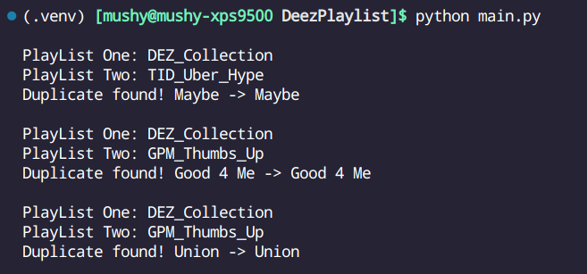

# Stupid Simple Deezer Playlist Comparer

This code allows you to download _public_ playlist data from a _public_ deezer profile and then compare playlists against eachother.

No login required.

Built on the [deezer-python](https://github.com/browniebroke/deezer-python) api wrapper package.

---

### Features

- Compare one playlist against another playlist
- Compare one playlist against multiple playlists
- Comparing shows you the duplicate songs found in each playlist

---

### Usage

Edit `main.py` as needed!

**First:** Install the deezer api wrapper package dependency `pip install deezer-python`

<br/>
<br/>

**Second:** download the playlist data:

```
import getPlaylistData
getPlaylistData.downloadPlayListData(DEEZER_USER_ID)
```

Note: the `DEEZER_USER_ID` can be found by navigating to your deezer profile and copying the id from the url

- Example:
- `https://www.deezer.com/us/profile/4063572262/playlists`
- The `DEEZER_USER_ID` is `4063572262`

Note: the only data saved is `songID, title, artistName`

<br/>
<br/>

**Third:** compare the playlist data

Comparing one file against another

```
comparePlaylists.findDuplicates("some_playlist", "another_playlist")
```

<br/>

Comparing one file against multiple

```
ignoreFiles = ["mix_tape1", "some_other_mix_tape"]
comparePlaylists.massCompare("songs_I_think_I_have", ignoreFiles)
```

- Note: `massCompare()` will compare `songs_I_think_I_have` against all files in the `PlayListData` directory that is generated.

- To specify playlist files to ignore, pass a list of the file names `ignoreFiles = ["mix-tape_1", "some_other_mix_tape"]`

---

### Screen shot

Example output of running `massCompare()`


